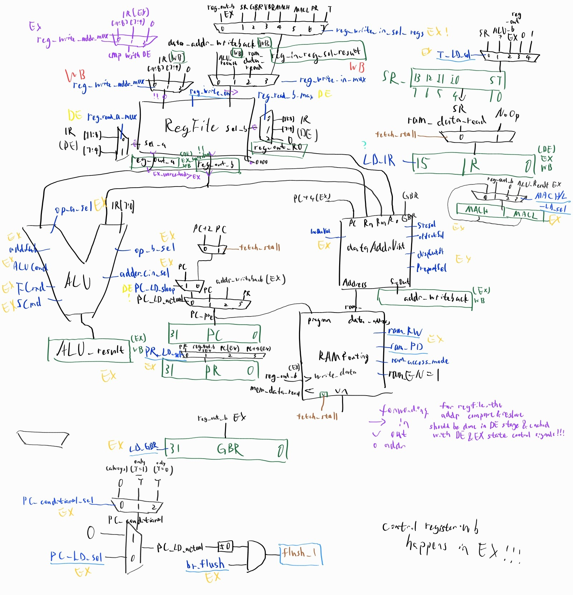
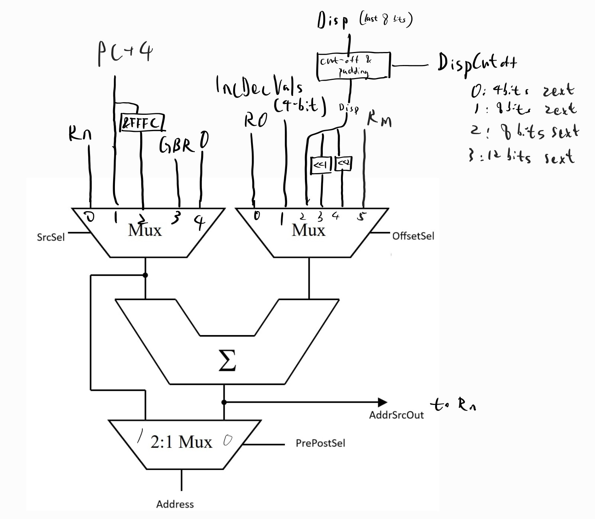

## SuperH2 CPU
A simple VHDL implantation of HITACHI (Renesas) SH2 architecture CPU with 4-stage pipeline (IF->DE->EX->WB). Core implementation in sh2cpue.vhd

See instructions.pdf for the supported instructions. Those marked in red are not implemented.

32 bit input mul instructions are removed for now due to extremely long data path

#### Running simulation
Choose the test to run in memory.vhd:186
```bash
make
```
memory.vhd:170:9:(report note): 256/256 matches

Data transfer test (xfern) would fail three datapoints due to the lack of MOV.B/W R0 <-> @(disp, Rn) commands

Test 3 (3.bin) would fail two datapoints due to the removal of 32 bit multiplications

Tested with program compiled from test_mem_content/3.asm, covering branch, alu and mov commands.

Some dedicated test are added, including logic, shift, arith(arithmetic), xfern (data transfers), branc(branch). 
Final memory content compared with simulation results.


#### To-dos: short-term goals
- Expand datapath to support for self-incrementing mov (stack pop) instructions, store/load control regiter (ST, LD) directly from memory instructions, SH3 SHAD, SHLD instructions. 
- Add more realistic memory interface model with RAM delay simulated. (might want to add a dedicated stage for memory operation).
- SH3-style MMU.
- Add inturrupt support, and implementing SH3 style TRAPA/RTE commands (store SR and PC and R15(stack pointer)in dedicated registers rather than on memory stack like that in SH2).
- Instruction and Data cache (set-associative).

#### Long-term goals
- TAS instruction for atomic operation
- Multiple issue.
- Branch prediction.
- Out-of-order execution (would break branch delay slots).

#### Reference: CPU dataflow and wiring
##### Top-level

##### ALU

##### Addressing unit



